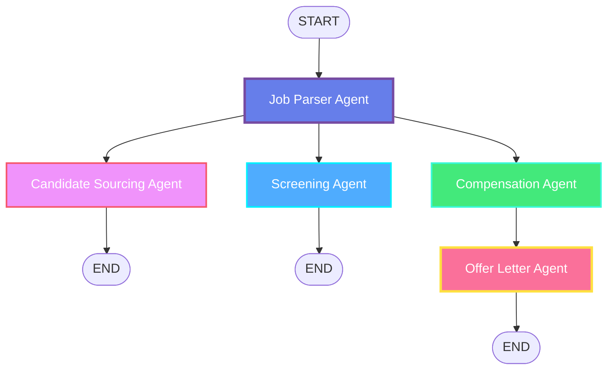

# 🤖 Multi-Agent HR Recruiting System

> **AI-Powered Parallel Processing for Complete Recruiting Workflows**

Transform job descriptions into complete recruiting packages in seconds using parallel AI agents powered by OpenAI GPT-4.

## 🎯 What This Does

Input a job description → Get complete recruiting package:
- ✅ Parsed job requirements and skills
- ✅ Candidate sourcing strategy
- ✅ Screening questions and criteria
- ✅ Market-competitive compensation package
- ✅ Professional offer letter (ready to send!)

**Time**: 10-15 seconds | **Cost**: ~$0.02-$0.06 per run

## 📦 Two Implementations Included

This project includes **two versions** of the same system:

### 1️⃣ Pure Async Version (Simpler)
- **Files**: `app.py`, `agents.py`
- **Best for**: Quick setup, simple workflows
- **Dependencies**: Just `streamlit` + `openai`
- **Run**: `streamlit run app.py`

### 2️⃣ LangGraph Version (More Powerful)
- **Files**: `app_langgraph.py`, `langgraph_recruiting.py`
- **Best for**: Complex workflows, graph visualization
- **Dependencies**: `+langgraph` + `langchain`
- **Run**: `streamlit run app_langgraph.py`

**Not sure which to use?** See [COMPARISON.md](COMPARISON.md) for detailed comparison.

## 🚀 Quick Start (Choose One)

### Option A: Pure Async (Recommended for First Time)

```bash
# Install dependencies
pip install streamlit openai

# Run the app
streamlit run app.py

# Enter your OpenAI API key in the sidebar
# Paste a job description
# Click "Start Parallel Processing"
```

### Option B: LangGraph (For Graph Visualization)

```bash
# Install dependencies
pip install -r requirements_langgraph.txt

# Run the app
streamlit run app_langgraph.py

# Enter your OpenAI API key in the sidebar
# See the visual workflow graph
# Execute and watch agents work in parallel
```

## 📋 Prerequisites

1. **Python 3.8+**
2. **OpenAI API Key** (Get one at https://platform.openai.com/api-keys)
3. **Basic command line knowledge**

## 🎨 Workflow Visualization



## 🤖 The 5 AI Agents

### 1. Job Parser Agent 📋
**What it does**: Analyzes job description using GPT-4
- Extracts job title, experience level, employment type
- Identifies required and nice-to-have skills
- Parses responsibilities and qualifications

### 2. Candidate Sourcing Agent 🔍
**What it does**: Creates sourcing strategy
- Recommends best platforms (LinkedIn, GitHub, etc.)
- Generates search keywords
- Provides outreach strategies and timeline

### 3. Screening Agent ✅
**What it does**: Builds evaluation framework
- Creates must-have vs nice-to-have criteria
- Generates customized interview questions
- Suggests technical assessments

### 4. Compensation Agent 💰
**What it does**: Analyzes and recommends compensation
- Performs market analysis
- Recommends competitive salary range
- Designs complete benefits package

### 5. Offer Letter Agent 📄
**What it does**: Generates professional offer letter
- Creates legally-sound offer letter
- Includes all position and compensation details
- Ready to customize and send

## ⚡ Why Parallel Processing?

**Sequential Processing** (old way):
```
Agent 1 → Agent 2 → Agent 3 → Agent 4 → Agent 5
Time: 50 seconds
```

**Parallel Processing** (our way):
```
        ┌─ Agent 2 ─┐
Agent 1 ├─ Agent 3 ─┤→ Agent 5
        └─ Agent 4 ─┘
Time: 12 seconds (80% faster!)
```

## 📁 Project Structure

```
├── app.py                      # Pure Async Streamlit app
├── agents.py                   # Pure Async agents
├── app_langgraph.py           # LangGraph Streamlit app  
├── langgraph_recruiting.py    # LangGraph workflow
├── generate_diagrams.py       # Mermaid diagram generator
├── requirements.txt           # Pure Async dependencies
├── requirements_langgraph.txt # LangGraph dependencies
├── README.md                  # This file
├── QUICKSTART.md             # Quick start guide
├── LANGGRAPH_GUIDE.md        # LangGraph detailed guide
├── COMPARISON.md             # Compare both approaches
└── *.mmd                     # Mermaid diagram files
```

## 📚 Documentation

- **[QUICKSTART.md](QUICKSTART.md)** - Get started in 5 minutes
- **[LANGGRAPH_GUIDE.md](LANGGRAPH_GUIDE.md)** - Deep dive into LangGraph
- **[COMPARISON.md](COMPARISON.md)** - Compare Async vs LangGraph
- **Inline code comments** - Both implementations are well-commented

## 💡 Example Usage

### Input
```
Senior Python Developer

We're seeking an experienced Python developer with 5+ years.

Requirements:
- Strong Python experience (Django/Flask)
- AWS cloud services
- PostgreSQL databases
- Excellent problem-solving

Responsibilities:
- Design scalable backend services
- Mentor junior developers
- Lead code reviews
```

### Output (in ~12 seconds)
- ✅ **Job Analysis**: "Senior Python Developer, 5+ years, Full-time"
- ✅ **Sourcing**: "LinkedIn, GitHub, Stack Overflow + keywords"
- ✅ **Screening**: "10 customized interview questions"
- ✅ **Compensation**: "$120K-160K + benefits package"
- ✅ **Offer Letter**: "2-page professional letter (ready to send)"

## 🎓 Learning Paths

### Beginner Path
1. Start with **Pure Async** version (`app.py`)
2. Read the code - it's straightforward Python
3. Understand how agents work independently
4. Experiment with modifying agent prompts

### Advanced Path
1. Start with **LangGraph** version (`app_langgraph.py`)
2. Study the graph structure in `langgraph_recruiting.py`
3. Visualize the workflow with Mermaid diagrams
4. Add conditional routing and new agents

## 🛠️ Customization

### Modify Agent Behavior

**Pure Async** (`agents.py`):
```python
class JobParserAgent(BaseAgent):
    def __init__(self):
        system_prompt = """You are an expert HR analyst...
        [CUSTOMIZE THIS PROMPT]"""
```

**LangGraph** (`langgraph_recruiting.py`):
```python
def job_parser_agent(state: RecruitingState):
    system_prompt = """You are an expert HR analyst...
    [CUSTOMIZE THIS PROMPT]"""
```

### Add New Agent

**Pure Async**: Create new `BaseAgent` subclass
**LangGraph**: Add new node function + edge to graph

See respective guides for details.

## 💰 Cost Breakdown

Using GPT-4o-mini (recommended):
- Job Parser: ~$0.01
- Sourcing: ~$0.01  
- Screening: ~$0.01
- Compensation: ~$0.01
- Offer Letter: ~$0.02

**Total per workflow**: $0.05-0.06

You can process **~200 job descriptions for $10**.

## 🔧 Troubleshooting

### "OpenAI API key not set"
→ Enter your API key in the sidebar (starts with `sk-`)

### "Rate limit exceeded"
→ Check your OpenAI usage limits

### Agents taking too long
→ Normal during OpenAI peak hours (usually 10-20 seconds)

### Import errors
→ Make sure you installed the right requirements file

## 🌟 Features

- ✅ **Real AI Processing** - Uses OpenAI GPT-4o-mini
- ✅ **True Parallel Execution** - All agents run simultaneously
- ✅ **Real-time Updates** - Watch progress as agents work
- ✅ **Professional Output** - Production-ready documents
- ✅ **Easy Customization** - Modify prompts and logic
- ✅ **Graph Visualization** - See workflow structure (LangGraph)
- ✅ **Download Results** - Export offer letters
- ✅ **Cost Effective** - ~$0.05 per complete workflow

## 🚧 Future Enhancements

Potential additions:
- [ ] Resume parsing and matching
- [ ] Interview scheduling agent
- [ ] Reference checking automation
- [ ] Email integration for sending offers
- [ ] ATS integration (Greenhouse, Lever, etc.)
- [ ] Multi-language support
- [ ] Candidate communication templates
- [ ] Analytics dashboard

## 🤝 Contributing

Ideas for improvements:
1. More sophisticated parsing algorithms
2. Integration with job boards
3. Machine learning for candidate matching
4. Additional agent types
5. Better error handling

## 📄 License

Open source - free for educational and commercial use.

## 🆘 Support

- **Issues**: Check the troubleshooting section
- **Questions**: Review the documentation files
- **Customization**: See inline code comments
- **Comparison**: Read COMPARISON.md

## 🎯 Best Practices

1. **Start Simple**: Use Pure Async version first
2. **Read the Guides**: Each implementation has detailed docs
3. **Customize Prompts**: Tailor agents to your needs
4. **Test Thoroughly**: Review AI output before using
5. **Monitor Costs**: Track your OpenAI API usage
6. **Iterate**: Start with basic prompts, refine based on results

## 🔗 Resources

- **OpenAI API**: https://platform.openai.com/docs
- **LangGraph Docs**: https://langchain-ai.github.io/langgraph/
- **Streamlit Docs**: https://docs.streamlit.io
- **Mermaid Live**: https://mermaid.live (visualize diagrams)

## 📊 Quick Decision Guide

**Choose Pure Async if:**
- First time with multi-agent systems
- Want minimal setup
- Simple, linear workflow
- Don't need visualization

**Choose LangGraph if:**
- Need workflow visualization
- Complex routing/logic required
- Plan to extend significantly  
- Want better debugging tools

**Still unsure?** Try both! They're both included and easy to switch between.

---

## 🚀 Get Started Now

```bash
# Clone or download this repository
cd hr-recruiting-system

# Option 1: Pure Async (simpler)
pip install streamlit openai
streamlit run app.py

# Option 2: LangGraph (more powerful)
pip install -r requirements_langgraph.txt
streamlit run app_langgraph.py
```

**Built with ❤️ using Python, OpenAI GPT-4, Streamlit, and LangGraph**

*Transform your recruiting workflow today!* 🎉
